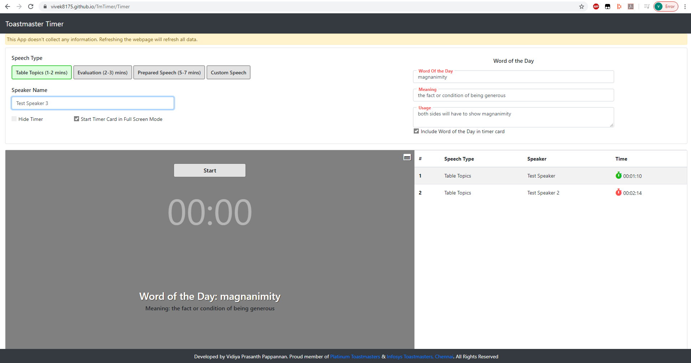
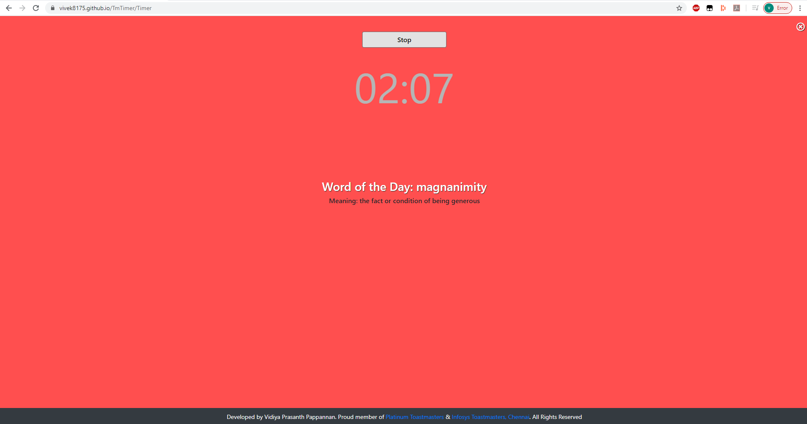

# vivek8175.github.io

Live Working Toastmaster Timer at https://vivek8175.github.io/TmTimer/Timer

This Online Toastmaster Timer app lets you control timings of a Toastmasters meeting. 

The application has options to choose speech type, enable or disable timer clock etc. 

This app also comes with Word of the Day display so that your speakers don't forget to use word of the day in their speeches.

